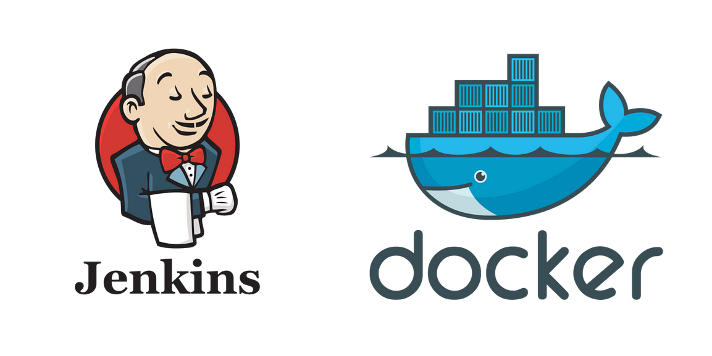
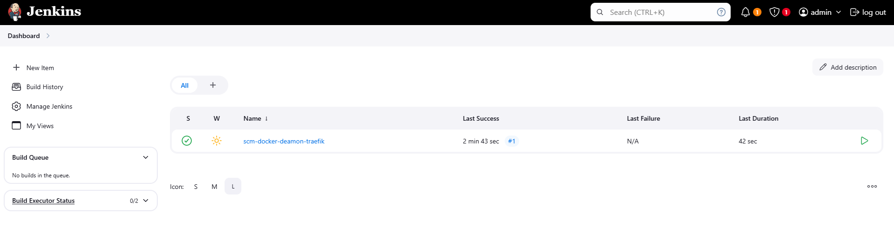

<h1 id="top" align="center">Core Jenkins</h1>

<br>

<div align="center">
    
</div>

<br>

## 🔍 Table of Contents

- [About Project](#intro)
- [Technologies](#technologies)
- [Dashboard](#dashboard)
- [Features](#features)
- [Releases](#releases)
- [System Startup](#system-startup)
- [Contributors](#contributors)

<br/>

<h2 id="intro">📌 About Project</h2>

The Core Jenkins project is a Dockerized Jenkins module designed for microservice architectures. The image includes Docker CLI, eliminating the need for Docker-in-Docker setups. Instead, it seamlessly integrates with the host machine Docker Daemon, ensuring efficient pipeline execution. It also utilizes bind-mounts for persistent storage, maintaining data consistency across restarts.
The preconfigured Docker Compose setup is available in the [`core-docker-config`](https://github.com/ahmettoguz/core-docker-config) repository, simplifying deployment. Additionally, this project includes a Jenkinsfile for testing Docker Daemon integration.

<br/>

<h2 id="technologies">☄️ Technologies</h2>

&nbsp; [](https://www.docker.com/)

&nbsp; [](https://www.jenkins.io/)

<br/>

<h2 id="dashboard">👨‍🍳 Dashboard</h2>

<div align="center">
    
</div>

<br/>

<h2 id="features">🔥 Features</h2>

- **Docker CLI Integration:** Provides Docker CLI eliminating the need for Docker-in-Docker setups.
- **Jenkinsfile:** Includes a Jenkinsfile for testing and pipeline configuration.
- **Persistent Data:** Utilizes bind mounts to persist data on the host machine, preventing data loss during container restarts.
- **Docker Compose Deployment:** Simplifies deployment with Docker Compose configuration, enabling easy setup and service orchestration without complex commands.
- **Docker Containerization:** The application is containerized using Docker to ensure consistent deployment, scalability, and isolation across different environments.

<br/>

<h2 id="releases">🚢 Releases</h2>

&nbsp; [](https://github.com/ahmettoguz/core-jenkins/tree/v1.0.0)

<br/>

<h2 id="system-startup">🚀 System Startup</h2>

- Create a new directory named `core`.
- Clone the [`core-docker-config`](https://github.com/ahmettoguz/core-docker-config) and [`core-jenkins`](https://github.com/ahmettoguz/core-jenkins) repositories into the `core` directory.

```
git clone https://github.com/ahmettoguz/core-docker-config
git clone https://github.com/ahmettoguz/core-jenkins
```

- Refer to the documentation provided in the [`core-docker-config`](https://github.com/ahmettoguz/core-docker-config) project for the system startup commands.

<br/>

<h2 id="contributors">👥 Contributors</h2>

<a href="https://github.com/ahmettoguz" target="_blank"></a>

### [🔝](#top)
